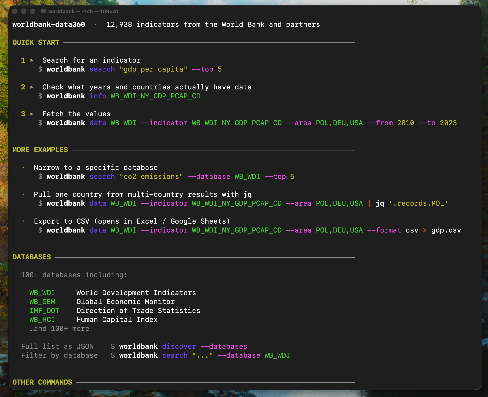

<p align="center">
  <h1 align="center">worldbank-data360</h1>
  <p align="center">TypeScript SDK and CLI for the World Bank Data360 API</p>
</p>

<p align="center">
  <a href="https://www.npmjs.com/package/worldbank-data360"></a>
  <a href="https://www.npmjs.com/package/worldbank-data360"></a>
  <a href="https://github.com/worldbank/open-api-specs"></a>
  <a href="https://github.com/rblyz/worldbank-data360?tab=MIT-1-ov-file#readme"></a>
</p>

<br/>



### [API Reference →](https://data360.worldbank.org/en/api#/)

<br/>

Access 12,000+ World Bank indicators — GDP, population, climate, health, education — from the terminal or your TypeScript code. No API key required.

**Install and start exploring:**

```bash
npm install -g worldbank-data360
worldbank discover
```

`discover` prints a quick start guide with examples — search, fetch, CSV export, jq patterns.

**Or run without installing:**

```bash
npx worldbank-data360 discover
```

**Or use as a TypeScript SDK:**

```ts
import { WorldBankClient } from 'worldbank-data360'

const client = new WorldBankClient()

const result = await client
  .data('WB_WDI')
  .indicator('WB_WDI_NY_GDP_PCAP_CD')
  .area(['POL', 'DEU', 'USA'])
  .from('2010').to('2023')
  .fetch()
```

<br/>

## CLI

```bash
# run without installing
npx worldbank-data360 search "gdp per capita" --top 5

# or install globally — then just `worldbank`
npm install -g worldbank-data360
worldbank search "gdp per capita" --top 5
```

### Step 1 — Start here

```bash
worldbank discover
```
```
worldbank-data360  —  12,938 indicators from the World Bank and partners

QUICK START

  1. Search for an indicator
       worldbank search "gdp per capita" --top 5

  2. Check what years and countries actually have data
       worldbank info WB_WDI_NY_GDP_PCAP_CD

  3. Fetch
       worldbank data WB_WDI --indicator WB_WDI_NY_GDP_PCAP_CD --area POL,DEU,USA --from 2010 --to 2023

  Filter one country from multi-country results with jq:
       worldbank data WB_WDI --indicator WB_WDI_NY_GDP_PCAP_CD --area POL,DEU,USA | jq '.records.POL'

  Export to CSV (opens in Excel / Google Sheets):
       worldbank data WB_WDI --indicator WB_WDI_NY_GDP_PCAP_CD --area POL,DEU,USA --format csv > gdp.csv
```

To get the full database list as JSON:

```bash
worldbank discover --databases
```
```json
{
  "totalIndicators": 12938,
  "databases": [
    { "id": "WB_WDI", "name": "World Development Indicators", "indicatorCount": 1534 },
    { "id": "WB_GEM", "name": "Global Economic Monitor", "indicatorCount": 801 },
    ...
  ]
}
```

### Step 2 — Find an indicator

Search across all 12,000+ indicators. Narrow by database to cut through noise:

```bash
worldbank search "life expectancy" --top 5 --database WB_WDI
```
```json
{
  "total": 549,
  "shown": 5,
  "items": [
    {
      "id": "WB_WDI_SP_DYN_LE00_IN",
      "name": "Life expectancy at birth, total (years)",
      "databaseId": "WB_WDI",
      "score": 76.2,
      "topics": ["People", "Health"]
    }
  ]
}
```

The indicator ID encodes the database: `WB_WDI_SP_DYN_LE00_IN` → database `WB_WDI`.

### Step 3 — Check coverage before fetching

Before fetching, see which countries and years actually have data:

```bash
worldbank info WB_WDI_SP_DYN_LE00_IN
```
```json
{
  "name": "Life expectancy at birth, total (years)",
  "database": "World Development Indicators (WDI)",
  "areas": 265,
  "years": "1960–2024"
}
```

If `years` is a **list** instead of a range, the indicator is not published annually:

```bash
worldbank info WB_HCI_HCI
```
```json
{
  "name": "Human Capital Index (scale 0-1)",
  "database": "Human Capital Index (HCI)",
  "areas": 186,
  "sex": ["F", "M"],
  "years": ["2010", "2018", "2020"]
}
```

`info` also shows disaggregation dimensions (`sex`, `age`, `urbanisation`) — if they appear, the data has breakdowns which will show up automatically in the records.

### Step 4 — Fetch data

```bash
worldbank data WB_WDI --indicator WB_WDI_SP_DYN_LE00_IN --area POL,DEU,USA --from 2010 --to 2023
```

**Multiple countries → records are automatically grouped by country code:**

```json
{
  "count": 42,
  "indicator": "WB_WDI_SP_DYN_LE00_IN",
  "indicatorName": "Life expectancy at birth, total (years)",
  "database": "WB_WDI",
  "databaseName": "World Development Indicators (WDI)",
  "meta": { "UNIT_MEASURE": "YR" },
  "records": {
    "DEU": [
      { "period": "2010", "value": 80.5 },
      { "period": "2011", "value": 80.6 }
    ],
    "POL": [...],
    "USA": [...]
  }
}
```

**Single country → flat array.** Repeated metadata fields appear once in `meta`, not in every record. SDMX placeholder values (`_T`, `_Z`) are stripped automatically.

**Indicators with sex/age breakdowns show dimensions per record automatically:**

```bash
worldbank data WB_HCI --indicator WB_HCI_HCI --area FIN,SWE --from 2018 --to 2020
```
```json
{
  "records": {
    "FIN": [
      { "period": "2018", "value": 0.814 },
      { "period": "2018", "SEX": "M", "value": 0.786 },
      { "period": "2018", "SEX": "F", "value": 0.844 }
    ]
  }
}
```

**Pagination is automatic** — the API caps at 1000 records per call. The SDK fetches all pages transparently. By default the CLI shows 100 rows — add `--all` to get everything, or `--top N` to set a custom limit.

**Export to CSV — open directly in Excel or Google Sheets:**

```bash
# multi-country → one row per country+year
worldbank data WB_WDI --indicator WB_WDI_NY_GDP_PCAP_CD --area POL,DEU,USA --from 2010 --to 2023 --format csv > gdp.csv
```
```
area,period,value
DEU,2010,40408.71
POL,2010,12602.34
USA,2010,48466.73
...
```

```bash
# indicators with sex/age breakdowns → each dimension becomes its own column
worldbank data WB_HCI --indicator WB_HCI_HCI --area FIN,SWE --from 2018 --to 2020 --format csv > hci.csv
```
```
area,period,value,SEX
FIN,2018,0.814484,
FIN,2018,0.786722,M
FIN,2018,0.844708,F
SWE,2018,0.80251,
...
```

Pipe JSON to jq: `worldbank data ... | jq '.records.POL'`

### Other commands

```bash
# preview a query without making a data request
worldbank explain WB_WDI --indicator WB_WDI_SP_POP_TOTL --area POL,DEU --from 2010 --to 2023

# list all countries with ISO alpha-3 codes
worldbank countries
```

The CLI shows contextual hints in stderr after each command — they don't pollute JSON output and can be silenced with `2>/dev/null`.

### All commands

| Command | Description |
|---|---|
| `worldbank discover` | List all 100+ databases with indicator counts |
| `worldbank search <query> [--top N] [--database ID]` | Search indicators by keyword |
| `worldbank info <INDICATOR_ID>` | Show name, countries, year range, and dimensions |
| `worldbank data <DB> --indicator <ID> [--area] [--from] [--to] [--top N] [--all] [--format json\|csv]` | Fetch data |
| `worldbank explain <DB> --indicator <ID> [...]` | Preview query without fetching |
| `worldbank countries` | List all countries with ISO codes |

<br/>

## SDK

```bash
npm install worldbank-data360
```

```ts
import { WorldBankClient } from 'worldbank-data360'

const client = new WorldBankClient()

const result = await client
  .data('WB_WDI')
  .indicator('WB_WDI_NY_GDP_PCAP_CD')
  .area(['POL', 'DEU', 'USA'])
  .from('2010').to('2023')
  .fetch()

// result.count    → number of records
// result.records  → DataRecord[]
```

`OBS_VALUE` from the raw API is always a string — the SDK casts it to `number`. Null and empty fields are stripped. Records are sorted by year, then country code. Pagination is handled automatically.

### Data queries

```ts
const builder = client.data('WB_WDI')

builder
  .indicator('WB_WDI_SP_POP_TOTL')
  .area(['POL', 'DEU', 'USA'])   // single string or array
  .from('2000')
  .to('2023')
  .sex('F')                       // demographic filters
  .age('Y15T24')
  .urbanisation('U')

const result = await builder.fetch()
```

### Search

```ts
const results = await client
  .search()
  .search('poverty')
  .database('WB_WDI')   // optional: filter by database
  .top(10)
  .fetchItems()
// → { total, shown, items: [{ id, name, databaseId, score, topics? }] }
```

### Discover databases

```ts
const overview = await client.discover()
// → { totalIndicators: 12938, databases: [{ id: 'WB_WDI', name: 'World Development Indicators', indicatorCount: 1534 }, ...] }
```

### Indicator dimensions

```ts
const dims = await client
  .disaggregation('WB_WDI')
  .indicator('WB_WDI_SP_POP_TOTL')
  .fetch()
// → [{ field_name: 'SEX', label_name: 'Sex', field_value: ['M', 'F', '_T'] }, ...]
```

### AI-first methods

```ts
// Preview query without fetching
const info = client
  .data('WB_WDI')
  .indicator('WB_WDI_SP_POP_TOTL')
  .area(['POL', 'DEU'])
  .from('2010').to('2023')
  .explain()

// Fetch and format as markdown table for an LLM prompt
const ctx = await client
  .data('WB_WDI')
  .indicator('WB_WDI_SP_POP_TOTL')
  .area('POL')
  .from('2020').to('2023')
  .toContext()
```

### Countries

```ts
const countries = await client.countries().fetch()
// → { meta: { total }, items: [{ id, name, region, incomeLevel }] }
```

### Error handling

```ts
import { SDKRequestError } from 'worldbank-data360'

try {
  await client.data('INVALID_DB').fetch()
} catch (err) {
  if (err instanceof SDKRequestError) {
    console.log(err.sdkError.message)     // "HTTP 400 from GET /data360/data"
    console.log(err.sdkError.suggestion)  // "Check your DATABASE_ID..."
    console.log(err.sdkError.docsUrl)
  }
}
```

<br/>

## API endpoints

| Method | Endpoint |
|---|---|
| `.discover()` | `POST /data360/searchv2` (facets) |
| `.data()` | `GET /data360/data` |
| `.search()` | `POST /data360/searchv2` |
| `.indicators()` | `GET /data360/indicators` |
| `.disaggregation()` | `GET /data360/disaggregation` |
| `.metadata()` | `POST /data360/metadata` |
| `.countries()` | `GET /V2/country` (World Bank V2) |

Both APIs are public — no authentication required.

<br/>

## Data attribution

Data sourced from the [World Bank Data360 API](https://data360api.worldbank.org) and [World Bank V2 API](https://api.worldbank.org/V2). Subject to [World Bank Terms of Use](https://www.worldbank.org/en/about/legal/terms-and-conditions).

This is an unofficial open-source wrapper, not affiliated with or endorsed by the World Bank Group.

## License

MIT
